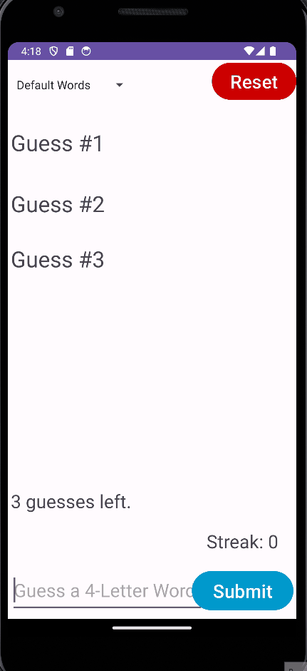
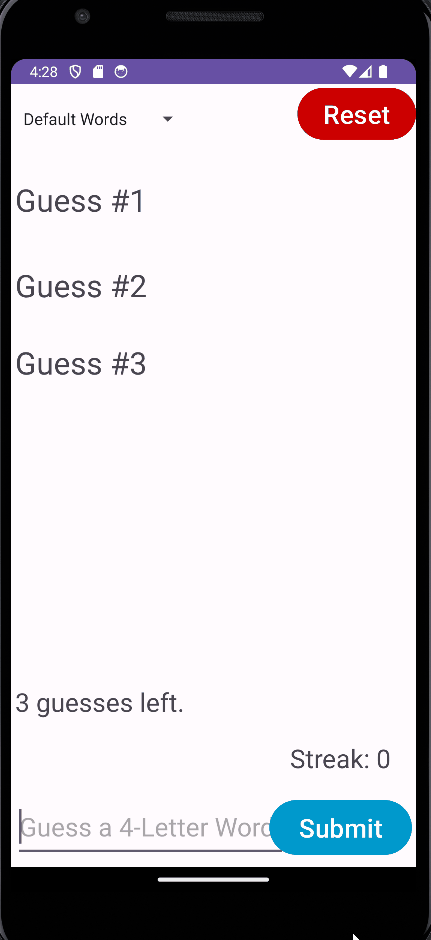

# Android Project 1 - *Wordle*

Submitted by: **Adam Ramsey**

**Wordle** is an android app that recreates a simple version of the popular word game [Wordle](https://www.nytimes.com/games/wordle/index.html). 

Time spent: **6** hours spent in total

## Required Features

The following **required** functionality is completed:

- [x] **User has 3 chances to guess a random 4 letter word**
- [x] **After 3 guesses, user should no longer be able to submit another guess**
- [x] **After each guess, user sees the "correctness" of the guess**
- [x] **After all guesses are taken, user can see the target word displayed**

The following **optional** features are implemented:

- [x] User can toggle betweeen different word lists
- [x] User can see the 'correctness' of their guess through colors on the word 
- [x] User sees a visual change after guessing the correct word
- [x] User can tap a 'Reset' button to get a new word and clear previous guesses
- [x] User will get an error message if they input an invalid guess
- [x] User can see a 'streak' record of how many words they've guessed correctly.

The following **additional** features are implemented:

* [ ] List anything else that you can get done to improve the app functionality!

## Video Walkthrough

Here's a walkthrough of implemented user stories:

Gameplay of Winning and Losing 
  
Error Handling and Word Lists 
  
GIFs created with [ScreenToGif](https://www.screentogif.com/) for Windows. 

## Notes

Describe any challenges encountered while building the app.
- Figuring out spinners for the word list section. It was difficult to find a way to use them in the way I did.
- Attempting to make an array of textViews an iterate over them. Scrapped this idea as I could not figure it out in an elegant way.
- Figuring out a way to hide the keyboard. This thread on StackOverflow helped me a lot! https://stackoverflow.com/questions/41790357/close-hide-the-android-soft-keyboard-with-kotlin/41791472#41791472
- General Kotlin syntax and uses; unfamiliar with it and still not completely used to it.
	

## License

    Copyright [yyyy] [name of copyright owner]

    Licensed under the Apache License, Version 2.0 (the "License");
    you may not use this file except in compliance with the License.
    You may obtain a copy of the License at

        http://www.apache.org/licenses/LICENSE-2.0

    Unless required by applicable law or agreed to in writing, software
    distributed under the License is distributed on an "AS IS" BASIS,
    WITHOUT WARRANTIES OR CONDITIONS OF ANY KIND, either express or implied.
    See the License for the specific language governing permissions and
    limitations under the License.
